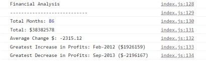

# Console-Finances
## Description
This is a project that mostly contain JavaScript. Code is avialable on [GitHub](https://github.com/Maeevee/Console-Finances.git). These are calculations of financial data for 3 and a half years. Was calculated:
- [x] The total number of months included in the dataset;
- [x] The net total amount of Profit/Losses over the entire period;
- [x] The average of the changes in Profit/Losses over the entire period;
- [x] The greatest increase in profits (date and amount) over the entire period;
- [x] The greatest decrease in losses (date and amount) over the entire period.
- Result:

## Installation
This is a web page deployed on [GitHub Pages](https://maeevee.github.io/Console-Finances/).

## Usage
To see the result you need to open console in Dev Tools in Google Chrome.

## License
MIT license
